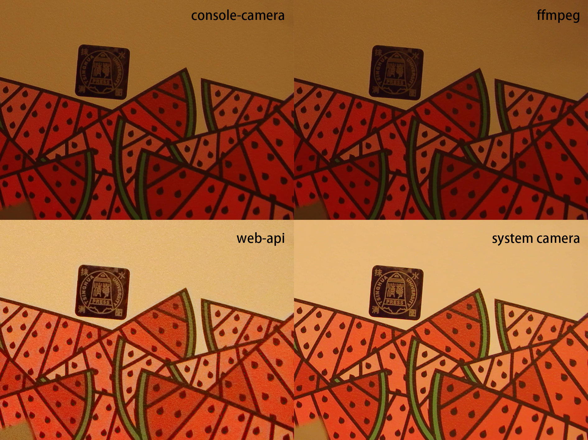
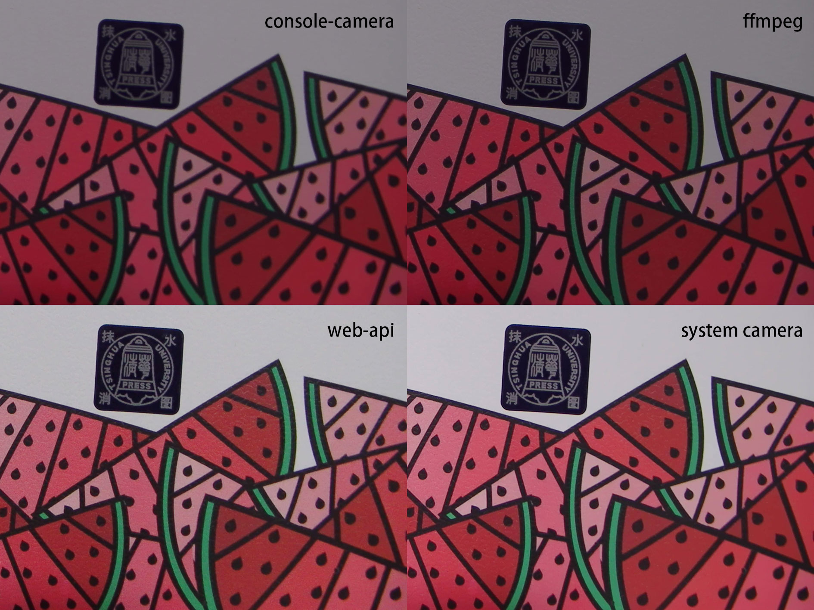

# Console-Camera

简易的命令行工具，用于在 Windows 上从控制台摄像头（UVC 摄像头）捕获图像，可用于其他程序的子程序。

当前程序在弱光环境下表现较差，正常环境表现与常规拍照软件相当，整体表现与 `ffmpeg` 测试效果相似。

A simple command-line tool to capture images from a console camera (UVC camera) on Windows, which can be used as a subroutine for other programs.

The current program performs poorly in low-light environments, performs comparably to regular camera software in normal environments, and overall performance is similar to `ffmpeg` test results.





## Usage

```bash
console-camera.exe <output_path> <device_identifier> <width> <height>
```

- `<output_path>`: 图片存储文件名，如 `output/capture`，设如果设备支持 MJPG 会优先使用。 (The output image file name, e.g., `output/capture`. If the device supports MJPG, it will be used preferentially.)
- `<device_identifier>`: 设备标识符，可以是 VID:PID 格式，如 `32e4:9415`。 (The device identifier, which can be in VID:PID format, e.g., `32e4:9415`.)
- `<width>` 和 `<height>`: 捕获的期望分辨率，如 `1920 1080`。 (The desired resolution for capture, e.g., `1920 1080`.)

## Why console-camera?

在使用 Electron 构建的程序上进行拍摄（使用 web api），效果似乎不如系统相机。

某 AI 推荐调用更底层的方法，于是有了本项目，用于实验和验证。

实验发现，通过对底层 API 的简单调参、调用，拍摄效果并不令人满意。
